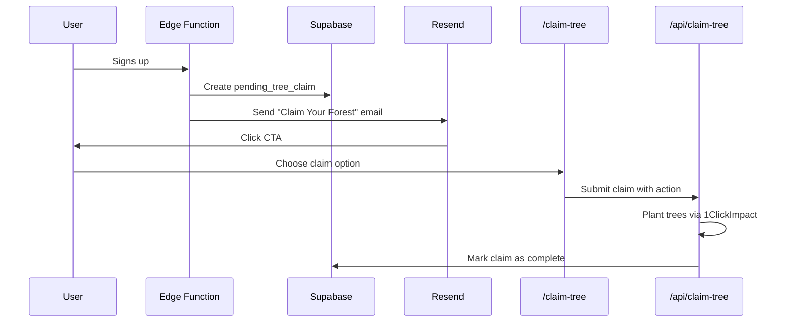

# Earn Your Forest - Gamified Tree Claim System

> **Status**: Planning complete, awaiting implementation  
> **Created**: 2026-01-20

Transform the free tree on signup into a growth engine that filters bots and drives team engagement.

## Problem

Bots are creating accounts programmatically, triggering free tree plantings. Email verification is pending Google approval.

## Solution

Instead of planting trees immediately on signup, send a "Claim Your Forest" email with gamified options that require human interaction.

---

## User Flow



---

## Claim Options

| Action | Trees Earned | Growth Impact |
|--------|-------------|---------------|
| ✅ **Quick Claim** | 1 tree | Validates real user |
| 👥 **Team Claim** (join/create) | 2 trees + team bonus | Network effects |
| 🔗 **Referral Claim** | 3 trees each | K-factor boost |

---

## Implementation Checklist

### Database
- [ ] Create `pending_tree_claims` table

```sql
CREATE TABLE pending_tree_claims (
    id UUID DEFAULT gen_random_uuid() PRIMARY KEY,
    user_id UUID NOT NULL REFERENCES auth.users(id) ON DELETE CASCADE,
    email TEXT NOT NULL,
    user_name TEXT,
    claim_token TEXT NOT NULL UNIQUE,
    trees_earned INT DEFAULT 0,
    claim_method TEXT DEFAULT NULL, -- 'quick', 'team_join', 'team_create', 'referral'
    claimed_at TIMESTAMPTZ DEFAULT NULL,
    created_at TIMESTAMPTZ DEFAULT NOW(),
    expires_at TIMESTAMPTZ DEFAULT (NOW() + INTERVAL '7 days'),
    referral_code TEXT UNIQUE,
    referred_by UUID REFERENCES auth.users(id)
);
CREATE INDEX idx_pending_tree_claims_token ON pending_tree_claims(claim_token);
```

### Backend
- [ ] Modify edge function: generate token, store pending claim, send email
- [ ] Create `/api/claim-tree` route for processing claims
- [ ] Create `/api/claim-tree/send-email` route for edge function to call

### Frontend
- [ ] Create `/claim-tree/[token]/page.tsx` with gamified options—@

### Email
- [ ] Create claim email template via Resend

---

## Open Questions

1. **Tree amounts** - Confirm rewards per action
2. **Claim expiry** - 7 days reasonable?
